# Hi, I'm Adarsh Kumar

B.Tech CSE graduate (2026) who builds things from the socket layer up — a SQL engine and a multi-client chat server in C++, and full-stack production apps in React, Node and PostgreSQL. Currently going deeper on AWS, Docker and CI/CD.

📍 Noida, India · 🎓 B.Tech CSE, 2026 · 💼 Available for full-time roles and freelance work

     

---

## 🔨 What I'm building

**[MedBill Pro](https://github.com/adarsh0707-kumar/medical-billing)** — Full-stack medical billing system: billing, inventory, customers, reporting. React + TypeScript frontend, Node/Express/Prisma backend, containerised behind nginx.

**[Database Engine](https://github.com/adarsh0707-kumar/Database-engine)** — SQL-like database engine in C++ with a custom parser, in-memory execution and file-based persistence.

**[Chat App](https://github.com/adarsh0707-kumar/Chat-app)** — Real-time multi-client chat server in C++ using POSIX sockets.

**[Task Manager](https://github.com/adarsh0707-kumar/taskmanager)** — Full-stack team task manager with role-based access control.

---

## 🧰 Tech I actually use

**Languages**

**Frontend**

**Backend & Data**

**Tooling & Infra**

---

## 🌱 Currently learning

AWS (IAM, EC2, VPC networking) · CI/CD pipelines · Docker in production · Advanced Next.js

## 🤝 Open to collaborating on

Full-stack web applications · DevOps and CI/CD tooling · Open source

---

## 📊 Stats

 
 

---

## 🏆 GitHub Trophies

---
### ✍️ Random Dev Quote

---
### 🔝 Top Contributed Repo

---

<!-- Proudly created with GPRM ( https://gprm.itsvg.in ) -->
