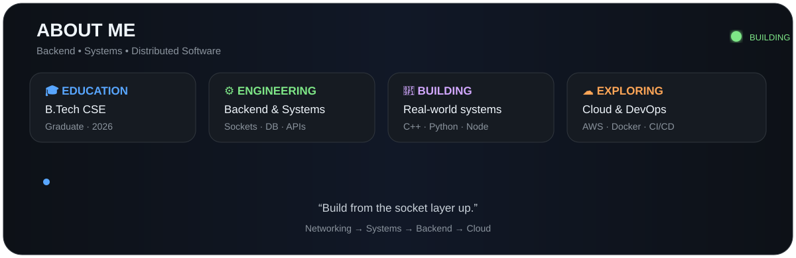
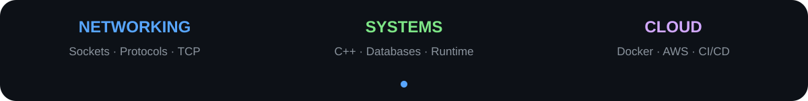
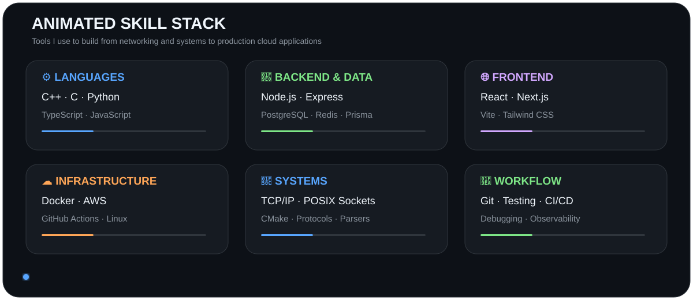
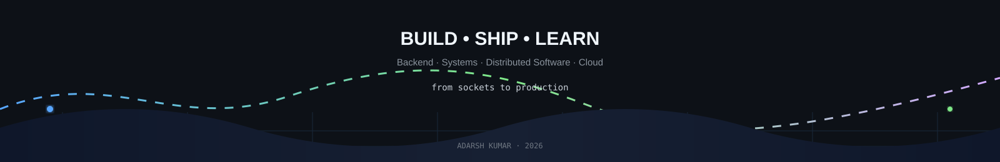

<!-- ═══════════════════════════════════════════════════════════════════════ -->
<!--                           ADARSH KUMAR                                  -->
<!-- ═══════════════════════════════════════════════════════════════════════ -->

---

## 👨‍💻 About Me

Hi, I'm **Adarsh Kumar**, a **B.Tech Computer Science Engineering graduate (2026)** focused on backend engineering, systems programming, distributed applications, and production-oriented full-stack development.

I like understanding what happens **below the framework level** — from sockets, protocols, parsers and database storage to APIs, queues, persistence, containers and deployment.

- 🎓 **B.Tech CSE — 2026**
- 🧠 Focused on **Backend Engineering & Systems**
- ⚙️ Building with **C++, Python, Node.js, React & PostgreSQL**
- 🏗️ Interested in **distributed systems, databases, networking and cloud infrastructure**
- ☁️ Currently going deeper into **AWS, Docker and CI/CD**
- 📍 **Noida, India**
- 💼 Open to **full-time roles and freelance opportunities**

---

## 🚀 Featured Projects

<table>
<tr>
<td width="50%" valign="top">

### 📈 Cloud-Based Algorithmic Trading Engine

Polyglot trading simulation platform built from the transport layer upward.

**C++ · Python · Node.js · React · PostgreSQL · Docker**

TCP transport · order-book matching · streaming analytics · risk management · persistence · observability.

<a href="https://github.com/adarsh0707-kumar/Trading-Engine">View Repository →</a>

</td>
<td width="50%" valign="top">

### ☁️ CodeForge Cloud

Cloud-native multi-language development platform with browser-based development, secure execution and collaboration workflows.

**TypeScript · React · Node.js · Cloud**

<a href="https://github.com/adarsh0707-kumar/CodeForge-Cloud">View Repository →</a>

</td>
</tr>
<tr>
<td width="50%" valign="top">

### 🗄️ Database Engine

SQL-like database engine written in C++ with a custom parser, in-memory execution and file-based persistence.

**C++ · Parsing · Query Execution · Storage**

<a href="https://github.com/adarsh0707-kumar/Database-engine">View Repository →</a>

</td>
<td width="50%" valign="top">

### 🔴 Redis Clone

Systems-oriented Redis implementation exploring networking, commands, data structures and server architecture.

**C++ · Networking · Systems Programming**

<a href="https://github.com/adarsh0707-kumar/redis-clone">View Repository →</a>

</td>
</tr>
<tr>
<td width="50%" valign="top">

### 🤖 Trao — AI Interview Prep Kit

Full-stack application for generating structured interview preparation kits.

**React · Node.js · TypeScript · PostgreSQL**

<a href="https://github.com/adarsh0707-kumar/Trao">View Repository →</a>

</td>
<td width="50%" valign="top">

### 💰 Welth

Modern full-stack financial application built with Next.js and production-oriented tooling.

**Next.js · React · TypeScript · PostgreSQL**

<a href="https://github.com/adarsh0707-kumar/welth">View Repository →</a>

</td>
</tr>
</table>

---

## 🧩 Engineering Focus

---

## 🛠️ Tech Stack

---

## 📊 GitHub Analytics

 

---

## 🏆 GitHub Trophies

---

## 🐍 Contribution Activity

---

## 🎓 Professional Learning

| Program | Area | Period |
|---|---|---|
| **S-CUBE / Satyam Software Solutions** | C++ & C Internship | Apr 2026 |
| **RCPL — ITS Engineering College** | Data Science with Python | May 2026 |

---

## 🌱 Currently Exploring

☁️ AWS · 🐳 Docker · 🔄 CI/CD · ⚡ Advanced Next.js · 🧱 Systems Engineering

---

## 🤝 Open to Collaborating On

Full-stack applications · Backend & infrastructure · Systems programming · Distributed systems · DevOps · Open source

---

## 🎯 What I'm Looking For

A software engineering environment where I can work on **real systems**, learn from experienced engineers, and contribute across backend, infrastructure, databases, networking and distributed applications.

---

## 📫 Connect With Me

 

